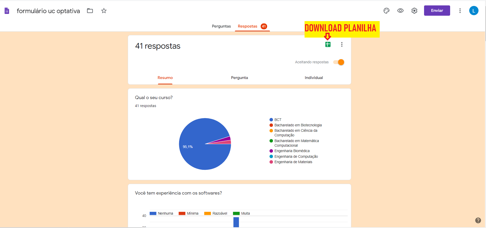
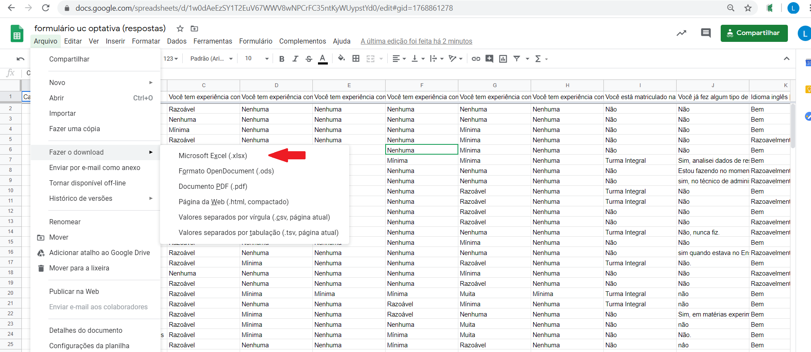
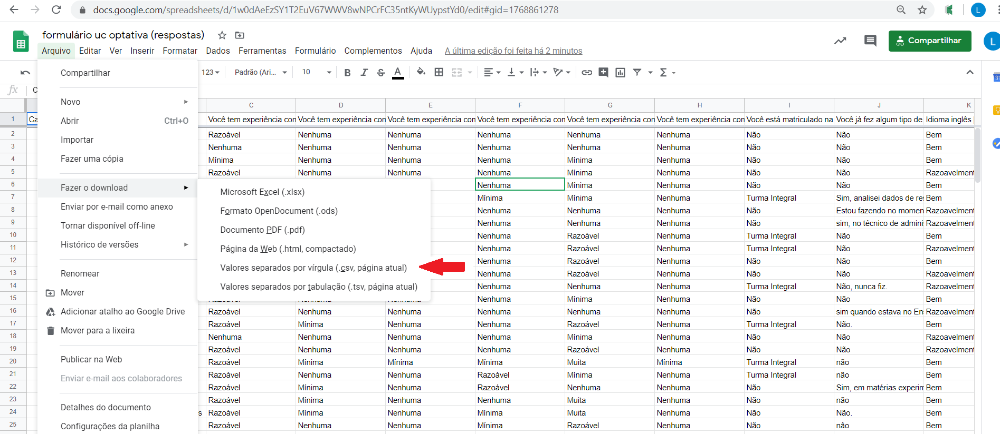
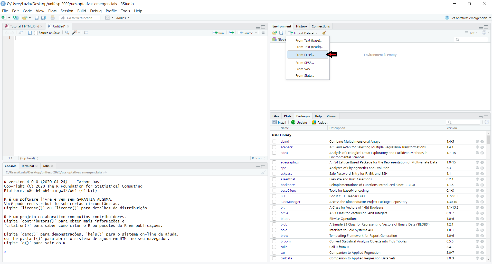
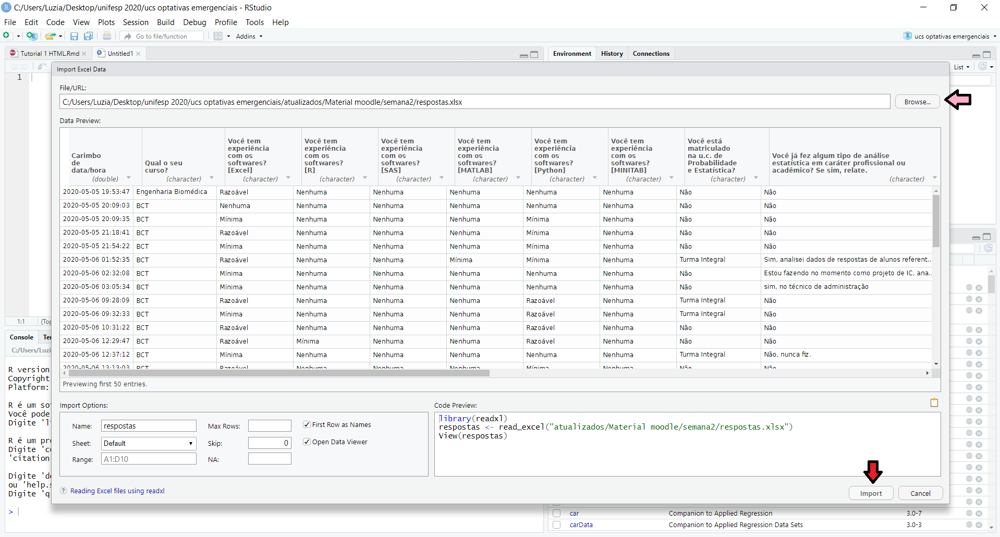
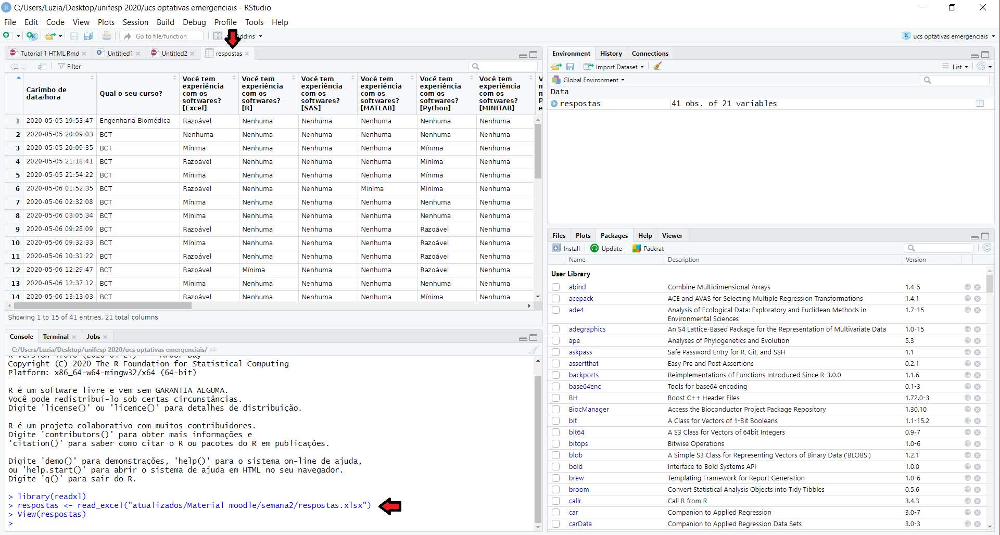
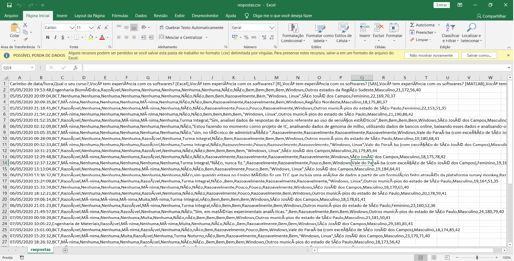
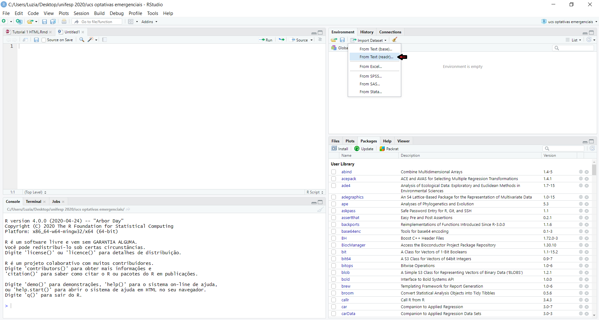

Todas as análises de dados estão sendo realizadas usando o R e o RStudio. 

O R é um software livre e de código aberto com uma imensa comunidade de desenvolvedores e usuários nacionais e internacionais e cresce muito rapidamente. Dessa forma, há muito material disponível com exemplos em R. Assim sendo, com pequenas modificações em códigos prontos disponíveis é possível, por exemplo, realizar análises gráficas, ajustar modelos de previsão, criar aplicativos web, sites e muito mais. 
O RStudio é uma plataforma integrada ao R e oferece vários recursos que facilitam a importação, a edição dos comandos e a visualização dos resultados obtidos. 

O R e o RStudio são compatíveis com Windows, linux e mac. 


## Para instalar o R e o RStudio

A instação do R e do RStudio pode ser realizada, respectivamente, pelos links https://cran.r-project.org/ e https://rstudio.com/products/rstudio/download/. 

Caso surjam dúvidas durante a instalação vocês podem consultar, por exemplo, o roteiro para instalação do R e RStudio que preparei disponível neste [link]( https://drive.google.com/file/d/1J7MjR0CXjNwk_wYcpx9RElHoKTxToWgV/view?usp=sharing). Entretanto, esse roteiro foi feito para que utiliza o sistema operacional Windows.

Escolha as versões mais atualizadas. 

## Para configurar o RStudio Cloud

Também é possível usar o R na nuvem, o que requer uma conexão com a internet. 

O RStudio Cloud pode ser acessado pelo link https://rstudio.cloud, sendo necessário criar uma conta no RStudio Cloud. Recomenda-se efetuar o login usando a sua conta Google para não ser necessário guardar uma nova senha.

Dê preferência para a instalação desses softwares em seu PC, pois poderá haver algumas incompatibilidades.


## Para instalar e carregar os pacotes no R

O R constituído por pacotes (packages) ou bibliotecas que são instaladas de acordo com a necessidade. Os pacotes ficam disponíveis no repositório do CRAN e todos são documentados.

Neste exemplo, estamos considerando os pacotes necessários para obter os gráficos do tutorial disponibilizado na OFICINA: Gerando gráficos com R e RStudio - excelência na análise de dados.

Uma forma para instalar os pacotes:

+ estando conectado a internet, copiar e colar a linha de comandos a seguir no editor do RStudio 

    ```r
    install.packages(c("summarytools", "fdth", "ggplot2", 
                       "readxl", "readr"))
    ```
Para rodar uma linha de comando devemos colocar o cursor em algum lugar da linha e clicar em **Run** no Menu superior no editor do RStudio.

Uma forma para carregar os pacotes:

+ usar o comando require  

    ```r
    require(summarytools)
    require(fdth)
    require(ggplot2)
    require(readxl)
    require(readr)

    ```

## Para entrar com os dados no R 

+ #### Digitando 


Algumas vezes quando se tem poucos dados pode ser conveniente digitá-los. Os exemplos a seguir ilustram a entrada de dados de variáveis qualitativa e quantitativa. Os exemplos utilizados são do livro de Anderson, David R.

##### Exemplo: variável qualitativa 

```{r, echo=TRUE}
# Comandos de Entrada para ler os dados de uma variável qualitativa e armazená-los em ex1  

ex1 <- c("Coke Classic","Diet Coke","Pepsi","Diet Coke",
"Coke Classic","Coke Classic","Dr. Pepper","Diet Coke",
"Pepsi","Pepsi","Coke Classic","Dr. Pepper","Sprite","Coke Classic",
"Diet Coke","Coke Classic","Coke Classic","Sprite","Coke Classic","Diet Coke",
"Coke Classic","Diet Coke","Coke Classic",
"Sprite","Pepsi","Coke Classic","Coke Classic","Coke Classic",
"Pepsi","Coke Classic","Sprite","Dr. Pepper",
"Pepsi","Diet Coke","Pepsi","Coke Classic","Coke Classic",
"Coke Classic","Pepsi","Dr. Pepper","Coke Classic","Diet Coke",
"Pepsi","Pepsi","Pepsi","Pepsi","Coke Classic","Dr. Pepper","Pepsi","Sprite")

ex1 # para visualizar os dados

```


##### Exemplos: variável quantitativa 

```r 
ex2 <- c(2, 5, 10, 12, 4, 4, 5, 17, 11, 8, 9, 8, 12, 21, 6, 8, 7, 13, 18, 3) # tempo de espera em minutos de pacientes

ex2 # para visualizar os dados

x<- c(2, 5, 1, 3, 4, 1, 5, 3, 4, 2)  # número de comerciais

y<- c(50, 57, 41, 54, 54, 38, 63, 48, 59, 46)  # valores vendas (em milhares de reais)

x;y # para visualizar os dados

```


+ #### Importando uma planilha de respostas, por exemplo, de um formulário Google

A planilha de um formulário do Google (Google Forms) pode ser salva em xlsx ou csv. Neste tutorial são apresentadas algumas alternativas para a leitura dos dados levando em conta por exemplo a acentuação e outros caracteres especiais. 


##### Passo 1: Realizar o download da planilha

Para isso clicar no botão criar planilha na aba respostas do formulário google a ser importado como exemplificado abaixo.





##### Passo 2: Escolher a extensão para salvar o arquivo ``xlsx`` (1) ou ``csv`` (2). 

###### (1) ``xlsx``



###### (2) ``csv``



##### Passo 3: Renomear o arquivo. Não pode haver acentos. 

Neste exemplo os arquivos foram salvos com nomes *respostas.xlsx* e *respostas.csv*.


##### Passo 4: Importação no R (RStudio)

##### <span style="color:orange">**4.1 Importação arquivo ``xlsx``**</span>

##### Passo 1: Clicar em ``Import Dataset`` e selecionar ``From Excel``.




##### Passo 2: Clicar em ``Browse`` para localizar o arquivo e depois em ``Import``.




###### O R armazena a planilha importada em um ``data.frame`` com mesmo nome do arquivo importado, neste caso ``resposta``. 





###### Há também a opção de digitar as linhas de comando abaixo para importar uma planilha ``xlsx`` usando o pacote ``readxl``:

```r
library(readxl)
respostas <- read_excel("Caminho_Arquivo")
View(respostas)
```

##### <span style="color:orange">**4.2 Importação arquivo ``csv``**</span>





##### Passo 1: Clicar em ``Import Dataset`` e selecionar ``From Text (readr)``.




##### Passo 2: Prosseguir como no caso de arquivo xlsx. 

##### As linhas de comandos para importação de arquivo ``csv`` usando o pacote ``readr``:

```r
library(readr)
respostas <- read_csv("Caminho_Arquivo")
View(respostas)
```
###### Uma forma alternativa para ler corretamente (considerando os acentos, etc...) os dados de um arquivo ``csv`` é fazer inicialmente o download do arquivo como ``xslx``  e depois usar o excel para salvá-lo como ``csv``. Dessa forma, o pacote básico do R pode ser usado.

```r
respostas <- read.csv("Caminho_Arquivo")
respostas
```

###### <span style="color:blue">Pode ser que seja necessário trocar read.csv por read.csv2 dependendo da versão do excel.</span>


###### **OBSERVAÇÃO:** Para que o R acesse o arquivo sem precisar especificar o caminho "C:/Pasta1/Subpasta1/Nome_Arquivo", ou seja, usando apenas o nome, basta salvar o código do R e o arquivo csv numa mesma pasta. 

## Brush up on markdown

Please complete this [10-minute interactive tutorial on Markdown](https://commonmark.org/help/tutorial/). 


